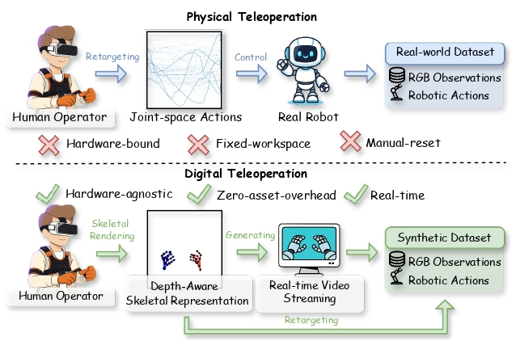
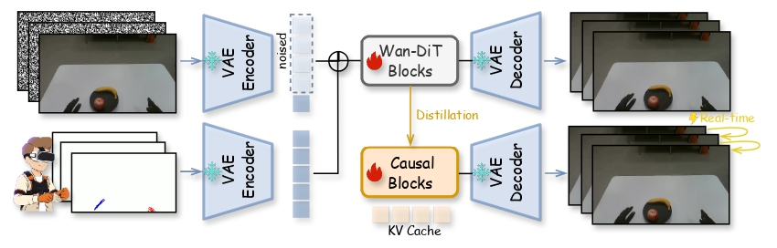

<div align="center">

## RynnWorld-Teleop: An Action-Conditioned World Model for Digital Teleoperation

</div>


<p align="center">
       💫 <a href="https://alibaba-damo-academy.github.io/RynnWorld-Teleop.github.io/"><b>Project Page</b></a>&nbsp;&nbsp; | &nbsp;&nbsp; 🤗 <a href ="https://huggingface.co/Alibaba-DAMO-Academy/RynnWorld-Teleop"><b> Hugging Face </b></a> &nbsp;&nbsp; | &nbsp;&nbsp; 🤖 <a href = "https://www.modelscope.cn/models/DAMO_Academy/RynnWorld-Teleop"><b> ModelScope</b></a>  &nbsp;|&nbsp; 🚀 <a href="https://huggingface.co/spaces/Alibaba-DAMO-Academy/RynnWorld-Teleop"><b>Demo</b></a> &nbsp;&nbsp; | &nbsp;&nbsp; 📄 <a href="https://arxiv.org/abs/2602.14979v1">arXiv</a>&nbsp;&nbsp;

</p>

---

## 🌟 Abstract

We introduce **RynnWorld-Teleop**, a robot-centric generative world model that instantiates the paradigm of **digital teleoperation**—decoupling robot data collection from physical hardware constraints. By transforming an operator’s real-time hand-pose stream into high-fidelity egocentric robotic videos from a single reference image, RynnWorld-Teleop enables the scaling of expert trajectories in a purely virtual environment. Our framework integrates depth-aware skeletal conditioning with a progressive human-to-robot training curriculum, allowing it to inherit rich manipulation priors from large-scale human datasets. To support interactive use, we distill the model into a causal, autoregressive student capable of real-time streaming. Policies trained exclusively on RynnWorld-Teleop synthetic data achieve effective zero-shot Sim2Real transfer, demonstrating its power as a high-fidelity data engine for scaling dexterous robotic learning.

<p align="center">
  
</p>
<p align="center">
  
</p>

---

## 📰 News
* **[2026.07.07]**  🔥🔥 Release our <a href="https://alibaba-damo-academy.github.io/RynnWorld-Teleop.github.io/assets/RynnWorld-Teleop_Report.pdf">Technical Report</a> !!
* **[2026.07.07]**  🔥🔥 Release our code and model checkpoints!!


---

## 🚀 Quick Start

### 🔧 Environment Setup

We use anaconda or miniconda to manage the python environment:
```bash
conda create -n "rynnworld-teleop" python=3.10 -y
conda activate rynnworld-teleop
pip3 install torch torchvision --index-url https://download.pytorch.org/whl/cu121
pip install -r requirements.txt
```

### 📖 Pretrained Model

Our model is developed on top of [Wan2.2-TI2V-5B](https://huggingface.co/Wan-AI/Wan2.2-TI2V-5B-Diffusers), please download the pretrained model from Hugging Face and place it in the `pretrained` directory as following structure:
```
RynnWorld-Teleop/
└── pretrained/
    └── Wan2.2-TI2V-5B-Diffusers/
        ├── model_index.json
        ├── scheduler/
        ├── transformer/
        ├── vae/
        └── ...
```

All training and inference scripts default to relative paths inside the repo (`pretrained/`, `training/`, `data/`). To point at a different location without editing scripts, override via environment variables, e.g.:
```bash
MODEL_PATH=/abs/path/to/Wan2.2-TI2V-5B-Diffusers 
bash scripts/rynnworld_teleop_pretrain.sh
```

Download our pretrained weights from HuggingFace and place them under `./pretrained`:
```bash
mkdir -p pretrained/RynnWorld-Teleop
huggingface-cli download Alibaba-DAMO-Academy/RynnWorld-Teleop --local-dir pretrained/RynnWorld-Teleop
huggingface-cli download Alibaba-DAMO-Academy/RynnWorld-Teleop-Causal --local-dir pretrained/RynnWorld-Teleop-Causal
```

Model Zoo

| Model            | HuggingFace | ModelScope |
| :--------------- | :---------: | :--------: |
| SFT  | [Link](https://huggingface.co/Alibaba-DAMO-Academy/RynnWorld-Teleop)    | [Link](https://www.modelscope.cn/models/DAMO_Academy/RynnWorld-Teleop)   |
| Causal  | [Link](https://huggingface.co/Alibaba-DAMO-Academy/RynnWorld-Teleop-Causal)    | [Link](https://www.modelscope.cn/models/DAMO_Academy/RynnWorld-Teleop-Causal)   |


---

## 🏋️ Training

We train the teacher model in **three stages**:

### 0️⃣ Stage 0 — Pretrain (egocentric human videos)
Full-parameter SFT on large-scale egocentric data, **no control video** conditioning. This stage absorbs general manipulation priors.

```bash
bash scripts/rynnworld_teleop_pretrain.sh
```

Key arguments:
- `--model_name rynnworld_teleop_pretrain`
- `--training_type sft`
- output → `training/rynnworld-teleop-${GPUs}gpu-SFT-pretrain/`

### 1️⃣ Stage 1 — Control-conditioned fine-tuning
Adds a zero-initialized `control_patch_embedding` (Conv3d) and a learnable `control_scale` to inject hand-pose control video into the diffusion process. Two options:

**LoRA** (lightweight, recommended for experimentation):
```bash
bash scripts/rynnworld_teleop_stage1_lora.sh
```
- `--training_type lora --rank 64 --lora_alpha 64`
- Trains only LoRA adapters + control modules
- output → `training/rynnworld-teleop-stage1-lora-${GPUs}gpu/`

**Full SFT** (best quality, more GPU memory):
```bash
bash scripts/rynnworld_teleop_stage1_sft.sh
```
- `--training_type sft`
- Trains the whole transformer + control modules
- output → `training/rynnworld-teleop-stage1-sft-${GPUs}gpu/`

Both variants need the Stage 0 checkpoint as their starting point. The scripts default to `training/rynnworld-teleop-32gpu-SFT-pretrain/checkpoint-3000`; override with an env var if your path differs:
- LoRA: `INIT_FROM_CHECKPOINT=<pretrain_ckpt> bash scripts/rynnworld_teleop_stage1_lora.sh`
- SFT:  `RESUME_FROM_CHECKPOINT=<pretrain_ckpt> bash scripts/rynnworld_teleop_stage1_sft.sh`

### 2️⃣ Stage 2 — Streaming Distillation
Distill the bidirectional Stage 1 teacher into a causal streaming student for real-time interactive generation. Two phases:

**Phase A — MSE warm-up** (bridge bidirectional → causal, single-step velocity regression):
```bash
MODEL_PATH=pretrained/Wan2.2-TI2V-5B-Diffusers \
TEACHER_CKPT=<stage1_sft_checkpoint> \
DATA_PATH=data/sample_data.json \
  bash scripts/rynnworld_teleop_streaming_mse.sh
```
- Runs single-step v-flow MSE training with block=3 streaming (Self-Forcing aligned) + FixedSizeCache.
- Default: 4000 steps on ZeRO-2, effective batch scales with `TOTAL_GPUS × GRADIENT_ACCUMULATION_STEPS` (defaults to 64 × 2 = 128).
- output → `outputs/mse/mse_sft_<port>/checkpoint-<N>/`

**Phase B — DMD distillation** (4-step adversarial distillation from teacher, resumes from the MSE checkpoint):
```bash
MODEL_PATH=pretrained/Wan2.2-TI2V-5B-Diffusers \
TEACHER_CKPT=<stage1_sft_checkpoint> \
DATA_PATH=data/sample_data.json \
RESUME_FROM=outputs/mse/mse_sft_<port>/checkpoint-4000 \
  bash scripts/rynnworld_teleop_streaming_dmd.sh
```
- Resumes generator + critic from the MSE checkpoint; the critic is auto-initialized from the student weights at the MSE→DMD transition (CausVid recipe).
- Default: 3000 DMD steps (total `MSE_END_STEP + 3000`).
- Optional `CRITIC_CKPT=<path/to/critic.pt>` to initialize critic from a pretrained denoiser.
- output → `outputs/dmd/dmd_<port>/checkpoint-<N>/`

Multi-node example (platform sets `WORLD_SIZE / RANK / MASTER_ADDR / MASTER_PORT / NPROC_PER_NODE`):
```bash
WORLD_SIZE=8 RANK=<0..7> MASTER_ADDR=<host> MASTER_PORT=<port> NPROC_PER_NODE=8 \
  bash scripts/rynnworld_teleop_streaming_dmd.sh
```

### Resuming training
Set `--resume_from_checkpoint <full_path_to_checkpoint>` in any script to continue. All optimizer state, scheduler, EMA weights, and random states are restored automatically.

---

## 🎬 Inference

We provide **two inference entry points** depending on which stage's checkpoint you want to use.

### 1️⃣ Pretrain model — text + image → video (no control)

```bash
python inference_pretrain.py \
  --checkpoint <pretrain_checkpoint_dir> \
  --output results/pretrain \
  --data_json <data.json> \
  --num_samples 20
```

### 2️⃣ Stage 1 model — image + control video → video

**This is the main user-facing inference.** Given a first-frame image and a control video (hand-pose / OpenPose mp4), the model generates the corresponding egocentric video.

#### SFT checkpoint
```bash
python inference_user.py \
  --image <first_frame.png> \
  --control_video <control.mp4> \
  --output results/my_demo \
  --prompt "Describe the action in one sentence." \
  --checkpoint <sft_checkpoint_dir> \
  --mode sft \
  --control_type add \
  --seeds "42,123,7"
```

#### LoRA checkpoint
```bash
python inference_user.py \
  --image <first_frame.png> \
  --control_video <control.mp4> \
  --output results/my_demo_lora \
  --prompt "Describe the action in one sentence." \
  --checkpoint <lora_checkpoint_dir> \
  --mode lora \
  --lora_rank 64 \
  --lora_alpha 64 \
  --control_type add \
  --seeds "42,123,7"
```

**Required arguments**
- `--image`: first-frame image (jpg/png), automatically resized to 832×480
- `--control_video`: control video mp4 (hand-pose / OpenPose), sampled/interpolated to 81 frames
- `--output`: output directory

**Useful options**
- `--mode sft|lora`: which checkpoint type to load (default: `sft`)
- `--prompt`: optional natural-language description (encoded with the T5 text encoder)
- `--text_embedding`: alternative pre-encoded prompt embedding `.safetensors`
- `--seeds "42,123,7"`: generate multiple samples in one run
- `--no_ema`: use raw weights instead of EMA
- `--guidance_scale`: classifier-free guidance scale (default 1.0)
- `--control_type add|concat|add-plus`: how the control signal is merged

**Outputs**
```
<output_dir>/
├── generated_seed{N}.mp4   # one per seed
├── control.mp4             # control signal decoded back to RGB (for sanity check)
├── control_raw.mp4
└── input_latent.safetensors  # intermediate, can be deleted
```

---

## 🌊 Streaming Inference (Real-time)

For real-time streaming inference with the distilled causal model, we provide `inference_streaming.py` which supports frame-by-frame generation with KV cache.

### Basic Usage

```bash
python inference_streaming.py \
  --image first_frame.png \
  --control_video control.mp4 \
  --checkpoint <streaming_checkpoint> \
  --output results/streaming_demo
```

### Advanced Options

**FP8 Quantization** (Hopper GPUs: H100/H800 only):
```bash
python inference_streaming.py \
  --image first_frame.png \
  --control_video control.mp4 \
  --checkpoint <streaming_checkpoint> \
  --output results/streaming_fp8 \
  --fp8
```
- Automatically detects GPU compute capability
- Skips with warning on non-Hopper GPUs
- Requires `torchao` package

**torch.compile** (faster inference):
```bash
python inference_streaming.py \
  --image first_frame.png \
  --control_video control.mp4 \
  --checkpoint <streaming_checkpoint> \
  --output results/streaming_compiled \
  --compile
```
- First sample includes compile overhead (~30-60s)
- Subsequent samples run 1.3-1.6× faster

**Batch Inference from Dataset**:
```bash
python inference_streaming.py \
  --data_json data/sample_data.json \
  --checkpoint <streaming_checkpoint> \
  --output_dir results/batch_demo \
  --num_samples_per_dataset 3 \
  --fp8 --compile
```

### Streaming Model Architecture

The streaming model (`core/streaming/`) implements:
- **Causal Attention**: Frame-by-frame generation with sliding KV cache
- **Control Patch Embedding**: Skeleton/hand-pose conditioning
- **Dynamic Cache**: Efficient memory management for long sequences

Key components:
- `WanCausalTransformer3DModel`: Causal transformer with KV cache support
- `DynamicCache`: Sliding-window KV cache with sink frame preservation
- `WanStreamingPipeline`: Frame-by-frame inference pipeline

---

## 🧪 Quick Test with Sample Data

We provide **3 sample data points** for quick testing without downloading the full dataset.

### Sample Data Structure

```
data/
├── sample_data.json              # Dataset manifest (3 samples)
├── video_latents/                # Pre-encoded video latents
│   ├── assemble_disassemble_jigsaw_puzzle_0_0_rgb.safetensors
│   ├── basic_pick_place_0_0_rgb.safetensors
│   └── blowdry_hair_0_0_rgb.safetensors
├── text_embeddings/              # Text embeddings
│   ├── assemble_disassemble_jigsaw_puzzle.safetensors
│   ├── basic_pick_place.safetensors
│   └── blowdry_hair.safetensors
└── prompt_embeddings/            # Null prompt embedding
    └── e3b0c44298fc1c149afbf4c8996fb92427ae41e4649b934ca495991b7852b855.safetensors
```

### Quick Training Test

Test the training pipeline with sample data (single-node, 8 GPUs):

```bash
# Stage 0: Pretrain (SFT)
bash scripts/rynnworld_teleop_pretrain_single_node.sh

# Stage 1: Control-conditioned LoRA
bash scripts/rynnworld_teleop_stage1_lora_single_node.sh

# Stage 1: Control-conditioned Full SFT
bash scripts/rynnworld_teleop_stage1_sft_single_node.sh
```

These scripts use `data/sample_data.json` and train for a few steps to verify the pipeline works correctly.

### Sample Data Format

Each entry in `sample_data.json`:
```json
{
  "video_latent_path": "data/video_latents/assemble_disassemble_jigsaw_puzzle_0_0_rgb.safetensors",
  "text_embedding_path": "data/text_embeddings/assemble_disassemble_jigsaw_puzzle.safetensors"
}
```

The video latent file contains:
- `video_latents`: [C, F, H, W] RGB video latent
- `control_video_latents`: [C, F, H, W] Control video latent (hand-pose/skeleton)

---

## 🎯 Demo Cases

We ship **8 representative cases** under `example/` for quick reproduction. Each case directory contains:
- `first_frame.png` — reference image
- `control_video.mp4` — hand-pose / skeleton control signal
- `text_embedding.safetensors` — pre-encoded prompt (pass via `--text_embedding`)

| # | Directory |
|---|-----------|
| 1 | `example/assemble_jenga_001/` |
| 2 | `example/basic_fold_009/` |
| 3 | `example/basic_pick_place_000/` |
| 4 | `example/clean_surface_001/` |
| 5 | `example/clip_unclip_papers_006/` |
| 6 | `example/color_004/` |
| 7 | `example/flip_pages_008/` |
| 8 | `example/fold_unfold_paper_basic_008/` |

To run all 8 cases at once:
```bash
for case in example/*/; do
  name=$(basename "$case")
  python inference_user.py \
    --image "${case}first_frame.png" \
    --control_video "${case}control_video.mp4" \
    --text_embedding "${case}text_embedding.safetensors" \
    --output "results/${name}" \
    --checkpoint <your_checkpoint> \
    --mode sft \
    --control_type add \
    --seeds "42"
done
```

---

## 📑 Citation

If you find this project useful, please cite:

```bibtex
@article{rynnworld_teleop,
  title  = {RynnWorld-Teleop: An Action-Conditioned World Model for Digital Teleoperation},
  author = {DAMO Academy, Alibaba Group},
  year   = {2026},
}
```

## License

Apache License 2.0 — see [LICENSE](LICENSE) for details.
